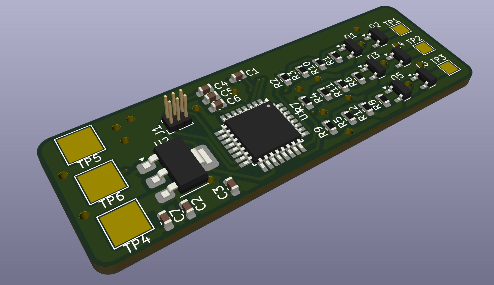
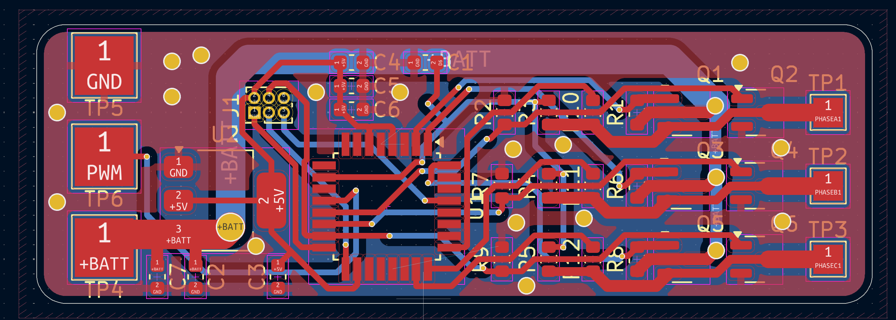
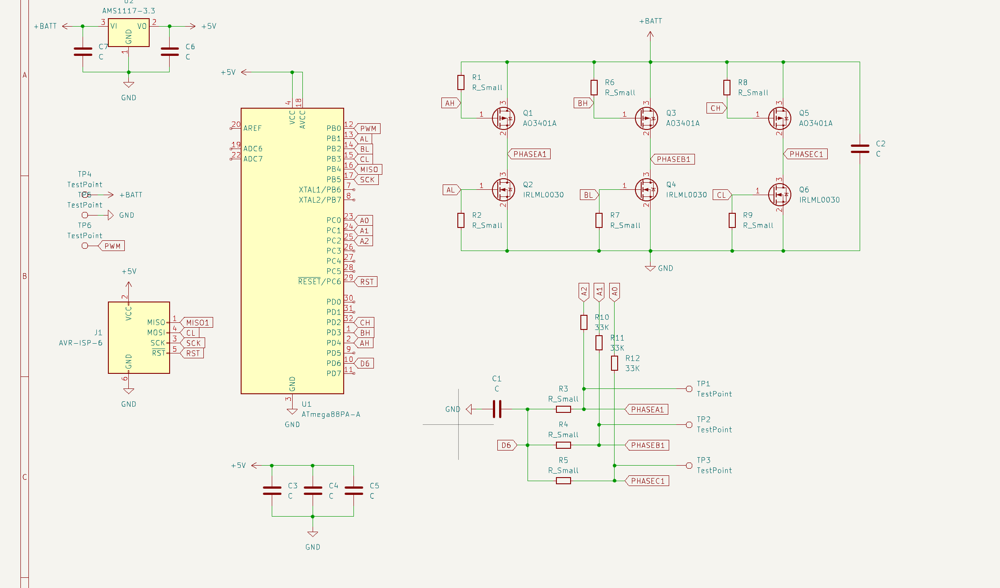

# Open-Source 3-Phase Sensorless ESC Firmware

This is an open-source firmware for controlling 3-phase sensorless BLDC motors using an ATmega88PA microcontroller running at 8 MHz (internal oscillator).  
It is designed for small electric vehicles, drones, robotics, and DIY ESC applications.  
The design uses 6 MOSFETs in a three-phase bridge configuration and includes back-EMF sensing for sensorless commutation.

---

## Features

- Sensorless 6-step (trapezoidal) commutation
- Automatic open-loop startup
- Zero-cross detection via ADC ISR
- Hardware timer-based phase PWM with dead-time
- RC PWM input for speed control
- Optional serial interface (UART) for speed setting
- Direction control and braking support
- Dead-time insertion to prevent MOSFET shoot-through
- Auto-calibrated ADC thresholds for zero-cross detection

---

## Schematic Overview

The system includes the following main blocks:

### Microcontroller

- **ATmega88PA**, powered at 5V using AMS1117-3.3 regulator from +BATT
- Internal 8 MHz oscillator (no external crystal)
- Key pins used:
  - `PD2` → PWM input (from RC receiver)
  - `PD3/PD4/PD5` → High-side MOSFET gates (AH, BH, CH)
  - `PB0/PB1/PB2` → Low-side PWM outputs (AL, BL, CL)
  - `PC0/PC1/PC2` → ADC inputs for Phase A/B/C sensing (A0, A1, A2)

### Power Stage

- 3-phase half-bridge using 6 MOSFETs (Q1–Q6)
- High-side: A03401A
- Low-side: IRLML0030
- Gate resistors to control switching speed and prevent ringing

### Back-EMF Sensing

- Analog divider + DC blocking on each motor phase
- Inputs go to `A0`, `A1`, and `A2`
- Used for zero-cross detection in closed-loop mode

### PWM Input

- Connected to `D2` for RC signal input (standard 1–2 ms pulses)
- Used to control speed and direction
- Interrupt-based decoding for accurate readings

### Serial Debug (optional)

- Via UART (TX/RX, `PD0`/`PD1`)
- Can be used to override speed or monitor state

---

## How to Use

### 1. Assemble the Hardware

- Follow the schematic to build the ESC on a PCB or breadboard
- Ensure proper power filtering (C2, C3–C6)
- Use heatsinks or airflow on the MOSFETs if under heavy load

### 2. Upload Firmware

- Connect AVR ISP programmer to the 6-pin header
- Use [AVRDude](https://www.nongnu.org/avrdude/) or the Arduino IDE
- Ensure fuse bits are set for:
  - Internal 8 MHz clock
  - No clock division
- Upload the `.ino` firmware file

### 3. Calibrate Zero-Crossing (Auto)

- When powered, the firmware automatically calibrates ADC offset thresholds
- Ensure the motor is disconnected or not rotating for accurate calibration

### 4. Run

- Connect an RC receiver or PWM generator to `D2`
- Pulse width controls speed and direction:
  - `< 1480 µs` = reverse
  - `1480–1520 µs` = brake
  - `> 1520 µs` = forward
- Motor will spin up in open-loop mode and switch to sensorless control

### 5. Serial Control (Optional)

- Connect USB-to-serial to TX/RX
- Open serial monitor at `115200 baud`
- Send a value from `0–255` to manually set the speed (for testing/debug)

---

## Motor Braking and Reverse

- Controlled by PWM signal:
  - Brake mode: both high and low sides turned off briefly
  - Reverse: same commutation order but in reverse
- No position feedback required

---

## Dead-Time Handling

- Implemented in software by carefully disabling/enabling high/low MOSFETs with a short delay (a few µs)
- Prevents simultaneous conduction and shoot-through

---

## Files Included

- `ESC_Firmware.ino` – Full firmware with PWM control, ISR ADC, RC interface
- `README.md` – Project documentation
- Schematic (`.png`) – Visual hardware design

---

## Supported Microcontrollers

- ATmega88PA (default)
- Can be ported to ATmega328P with minimal changes

---

## Test Points

- TP1–TP3: Phase voltages for probing/debug
- TP6: PWM input
- TP5: GND
- TP4: +BATT

---

## Pictures

---

## Safety Notes

- Always test with low-voltage supply first
- Double-check gate drive signals with oscilloscope
- Use overcurrent and overtemperature protection externally if needed

---

## License

MIT License — You can freely use, modify, and distribute this project.

---

## Author

Created by [Your Name / GitHub Handle]  
Feel free to fork, improve, and contribute via pull requests!